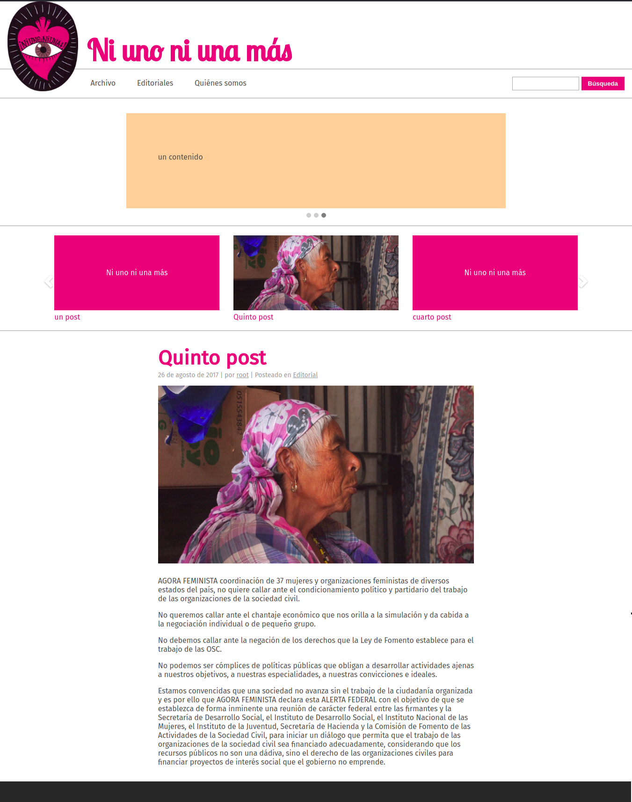

# Ni uno ni una más
### Proyecto UX/UI - Development - Deploy - Implement

### Descripción del proyecto
Ni uno ni una más es una organización sin fines de lucro que se dedica a hablar de temáticas de desaparición forzada y feminicidios. 

Actualmente tienen [un blog en blogspot](http://niunoniunamas.blogspot.mx/) desde donde postean todas sus investigaciones. La organización está buscando profesionalizar su proyección, por lo que blogspot ya no cumple sus requerimientos.

__Objetivo:__ Ofrecer un medio más robusto desde el cual divulgar su contenido. 

__Requerimientos:__ 
- La herramienta requerida es, primordialmente un gestor de contenido de bajo mantenimiento. 
- Debe soportar otros tipos de contenido además de blogposts
- La posibilidad de correr concursos u otro tipo de actividades

__Tipo de usuario:__ Existen 2 tipos de usuarios para este proyecto
1. Adultos de 45-65 años de edad, que saben poco de tecnología, involucrados con las problemáticas del país
2. Jóvenes de 20-35 años de edad, que utilizan medios digitales para informarse, involucrados con las problemáticas del país

### Solución 

Se escogió wordpress, ofreciendo una plantilla hecha a mano, que cumpliera con las necesidades de la organización. Las razones son:

- La organización cuenta con poco dinero para el desarrollo continuo. Wordpress permite en este sentido: 
  - Tener la mayor parte de las funciones requeridas 'out of the box' (control de usuarios, control de roles, gestión de contenido)
  - La posibilidad de que los administradores le den a la plataforma nuevas funciones sin necesidad de un desarrollador, a través de plugins
  - En caso de requerir mantenimiento o cambios, conseguir un desarrollador wordpress es fácil y barato
- Una vez que está diseñada la plantilla y echado a andar el proyecto, éste requiere de poco mantenimiento
- Si la organización quisiera cambiar de identidad el sitio, lo puede hacer simplemente cambiando la plantilla

### Etapa de diseño

Las consideraciones principales de diseño, según el objetivo del proyecto y los usuarios, fueron:
- Debido a la sensibilidad de los temas que maneja la organización (desapariciones, feminicidios) el diseño debía ser capaz de suavizar la percepción del usuario para hacer digeribles los temas.
- Proyectar la imagen de calidéz y sensibilidad que la organización quería dar sobre sus temas.
- Legibilidad para los adultos de 45-65 años que usan la página

Este es el diseño de la página anterior, la organización quería conservar el logotipo que aparece en el header.:

#### Primera iteración

Para la primera iteración, se presentó este diseño:

Este diseño tiene un slider con contenidos escogidos por el staff, y un carrousel con los últimos posts para navegar, así como el último post.
Se escogió:
- El color rosa-magenta para suavizar la imagen de la organización
- Se rendereó en un óvalo el logotipo
- Paleta de colores sencilla (blanco, gris, rosa-magenta)

Luego de rebotar los cambios, se pidió:
- Cambiar las tipografas serif para evitar la imagen de periódico, por las connotaciones de nota roja que puede tener la temática
- Oscurecer el tono de gris para mejor legibilidad para el demográfico más adulto
- Proponer una nueva tipografía para la organización que proyectara los valores de calidéz y sensibilidad. Se escogieron 6 tipografas que representaran los valores que la organización quera proyectar, de las que la organización escogió Lobster 2.

#### Presente iteración

Así va el progreso de la última iteración:

__Las funcionalidades__ son las siguientes:
- Primer slider editable por usuarios
- Carrusel que despliega los 10 últimos posts, en grupos de 3
- Despliegue de la última editorial en la página principal
- Subpágina de archivos
- Subpágina de editoriales
- Barra de búsqueda
- Archivos dinámicos
- Páginas estáticas

Se puede consultar [el repositorio aquí](http://github.com/ponentesincausa/niunoniunamas/).

#### ¿Qué sigue?

- Cambios estéticos a sliders y otros detalles
- Última ronda de retroalimentación con la organización
- Deployment
- Sesión de entrenamiento a editores
- Documentación en wiki 

